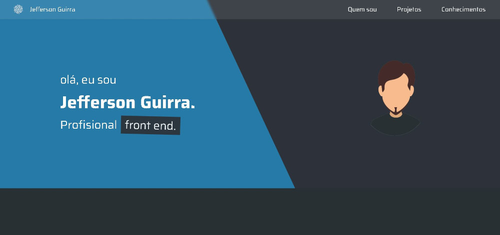

<h1 align="center">
  💻 Portfólio - Jefferson Guirra
</h1>

<h4 align="center"><a href="https://my-storage-jefferson.netlify.app/">Clique para visitar o projeto</a></h4>

## 📚 Seções

O site é composto por quatro seções:

- **Home:** Nele temos uma breve apresentação;
- **Quem sou:** Nessa seção tenho uma descrição dizendo um pouco sobre quem sou;
- **Projetos:** Apresenta alguns projetos desenvolvidos e com link direto para as perspectivas páginas web;
- **Conhecimentos:** Nele apresentamos meus conhecimentos em algumas linguagens como o foco no front-end;

---

## 💼 Tecnologias utilizadas

Para o desenvolvimento deste site utilizei as seguintes tecnologias:

- HTML;
- Css;
- JavaScript;

---

